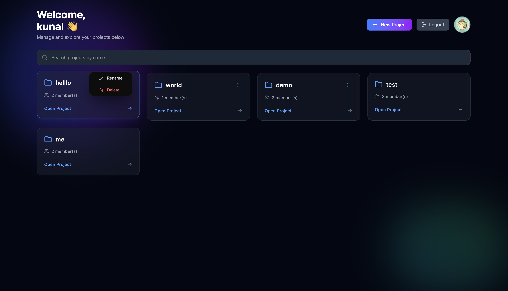
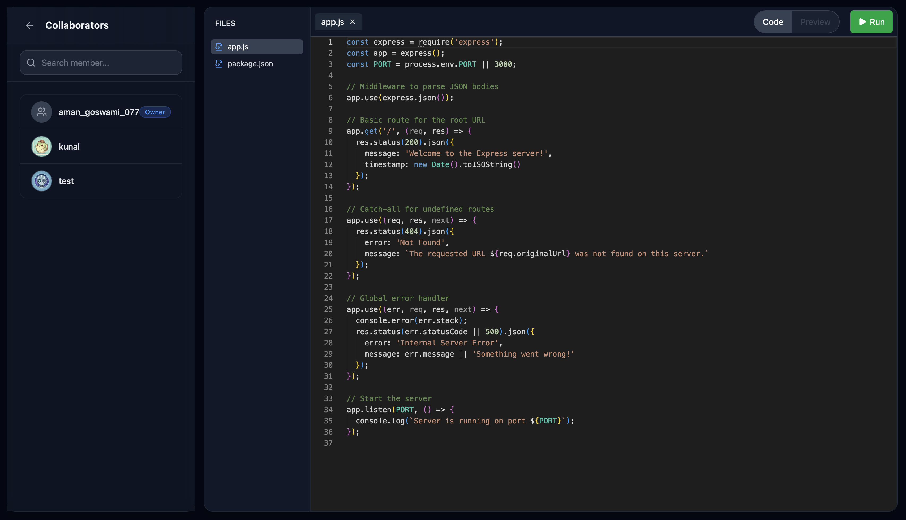

# ChatCraft – Real-Time Collaborative Code Editor

ChatCraft is a full-stack real-time collaborative coding platform that allows multiple users to join a shared room and write code together with live synchronization, similar to collaborative IDEs.

The project focuses on real-time communication, multi-user state synchronization, and scalable backend architecture using modern web technologies.

---

## Problem Statement

Modern development teams rely heavily on real-time collaboration tools, yet building such systems requires a strong understanding of state synchronization, event-driven architecture, and scalable backend communication.

ChatCraft was built to demonstrate a practical implementation of these concepts using the MERN stack and real-time technologies.

---

## Core Features

- Real-time collaborative code editing
- Multi-user project rooms
- Live synchronization using WebSockets
- File and folder management system
- User authentication and authorization
- Persistent data storage
- Responsive and interactive user interface

---

## Complete Tech Stack

### Frontend
- React.js
- JavaScript (ES6+)
- HTML5
- CSS3
- Context API for state management
- Axios for API communication

### Backend
- Node.js
- Express.js
- RESTful APIs
- JWT-based authentication

### Real-Time Communication
- Socket.io
- WebSockets

### Database
- MongoDB
- Mongoose (ODM)

### Authentication and Security
- JSON Web Tokens (JWT)
- Password hashing using bcrypt
- Protected API routes

### Development and Tooling
- Git and GitHub
- Postman for API testing
- npm for package management

---

## Application Architecture

- React frontend communicates with the Express backend through REST APIs
- Real-time events are handled using Socket.io
- MongoDB stores user data, projects, and file metadata
- JWT ensures secure authentication and authorization
- WebSocket events synchronize code changes across all connected users

---

## Screenshots

### Landing Page


### Dashboard


### Code Editor


---

## Live Demo

Frontend: https://chat-craft-xi.vercel.app  
Backend API: https://chatcraft-m2kh.onrender.com

---

## Installation and Setup

### Prerequisites
- Node.js
- MongoDB
- Git

### Steps

```bash
git clone https://github.com/Kunal-Gupta28/ChatCraft.git
cd ChatCraft

# Install backend dependencies
cd server
npm install

# Install frontend dependencies
cd ../client
npm install

# Run backend
cd ../server
npm start

# Run frontend
cd ../client
npm start
