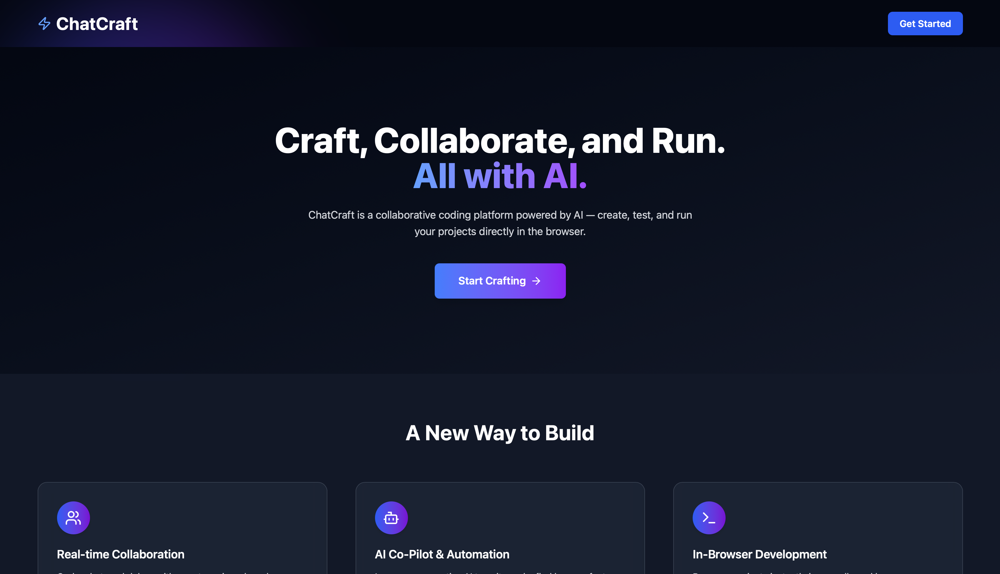
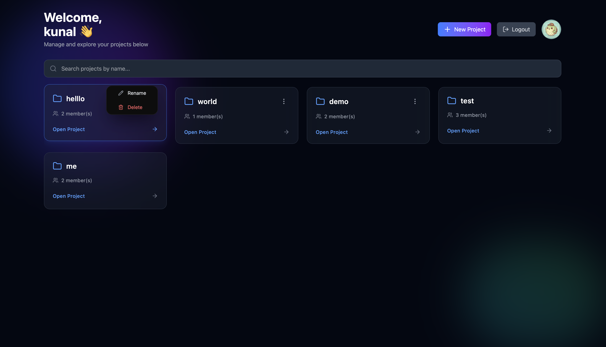
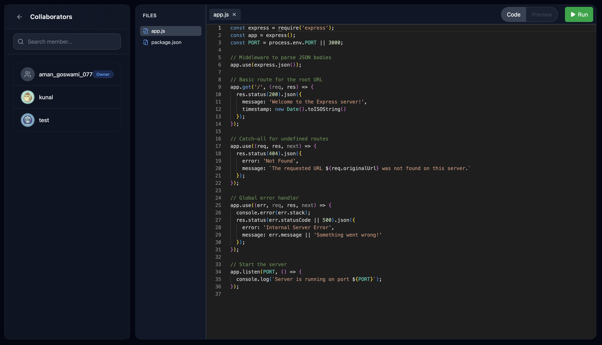

# 🚀 ChatCraft – Real-Time Collaborative AI Code Editor & Cloud IDE

ChatCraft is a full-stack, real-time collaborative coding platform and cloud IDE built with the MERN stack. It empowers developers and teams to create, edit, run, and collaborate on code in real time while leveraging an integrated **AI Assistant (@ai)** powered by Google Gemini and in-browser code execution using **WebContainers** and a **Browser Live Fallback Engine**.

---

## 🌟 Core Features

- ⚡ **Real-Time Code Collaboration**: Multi-user live project rooms with synchronized file editing and chat via Socket.io.
- ✏️ **Interactive Message Editing & Deletion**: Hover glass action bar on message bubbles with bottom input edit mode, keyboard shortcuts (`Enter`/`Esc`), and real-time socket sync (`project-message-edit`, `project-message-delete`).
- 🏷️ **@Mentions System & Header Navigation**: Auto-complete popover with keyboard navigation (`Up`/`Down`/`Enter`/`Esc`) and a header mention counter pill (`@ Mention X of Y`) that smooth-scrolls directly to mentioned messages.
- 🤖 **Integrated AI Assistant**: Ask questions, refactor code, or generate features directly in the workspace using `@ai`.
- 🌐 **Dual-Engine Preview System**:
  - **Chromium / Firefox Engine**: Native StackBlitz WebContainers (`@webcontainer/api`) WASM engine for in-browser Node.js/React apps.
  - **Safari & Mobile Live Fallback Engine**: CommonJS `require()` polyfill, `@babel/standalone` in-browser transpilation, and static asset inlining (`public/style.css`, `public/script.js`) for 100% identical live previews on Safari & iOS.
- 📁 **Dynamic File & Directory Explorer**: VS Code-inspired minimal file tree with extension-specific Lucide icons, custom folder color-coding, and an icon-only `[◧]` chat toggle.
- 💻 **Monaco Code Editor**: VS Code-powered code editing experience with syntax highlighting and multi-tab management.
- 🔐 **Secure Authentication & Token Management**: JWT authentication paired with Redis-backed token blacklisting for secure logouts.
- ⚡ **Optimized Data Layer**: Redux Toolkit state management, cached React Query data layer, and Mongoose ODM.

---

## 🏗️ Tech Stack

### **Frontend (`/frontend`)**
* **Core**: React 18, Vite, JavaScript (ES6+)
* **Styling & UI**: Tailwind CSS, Framer Motion, Lucide React Icons
* **Code Editor**: `@monaco-editor/react`
* **In-Browser Execution**: `@webcontainer/api`, `coi-serviceworker`
* **State Management**: Redux Toolkit (`@reduxjs/toolkit`), React Redux, TanStack React Query (`@tanstack/react-query`), React Context API
* **Real-Time Communication**: `socket.io-client`
* **HTTP Client**: Axios

### **Backend (`/backend`)**
* **Runtime & Framework**: Node.js, Express.js
* **Database & ODM**: MongoDB, Mongoose
* **Caching & Security**: Redis (Token Blacklisting)
* **Real-Time Engine**: Socket.io
* **AI Integration**: `@google/generative-ai` (Gemini API)
* **Authentication**: JSON Web Tokens (JWT), bcrypt

---

## 📂 Project Directory Structure

```text
ChatCraft/
├── backend/
│   ├── config/             # DB, Redis, Socket, and Axios configurations
│   ├── controllers/        # Route controllers (user, project, ai, etc.)
│   ├── middlewares/        # Auth & validation middlewares
│   ├── models/             # Mongoose schemas (user, project, message)
│   ├── routes/             # Express API route declarations
│   ├── services/           # AI & Socket background services
│   ├── utils/              # Helper utilities
│   ├── .env                # Backend environment variables
│   ├── app.js              # Express app setup
│   └── server.js           # HTTP & Socket.io server entry point
│
├── frontend/
│   ├── public/             # Static public assets
│   ├── src/
│   │   ├── components/     # UI Components (HomePage, ProjectPage, Code, Chat)
│   │   ├── config/         # Axios, Socket, and WebContainer clients
│   │   ├── contexts/       # React Context Providers (user, project, chat, codeEditor)
│   │   ├── pages/          # Page components (Home, Project, Auth, Landing)
│   │   ├── store/          # Redux Store & Slices (chatSlice, editorSlice, userSlice)
│   │   ├── utils/          # File tree normalization & tree helpers
│   │   └── main.jsx        # React application entry point
│   ├── .env                # Frontend environment variables
│   └── vite.config.js      # Vite build configuration
│
├── images/                 # Screenshot assets
├── handover.md             # AI Agent Handover Documentation
├── rerender_analysis_report.md  # Frontend Performance & Re-render Audit Report
└── README.md               # Project documentation
```

---

## ⚙️ Environment Variables Setup

### **Backend Environment (`backend/.env`)**
```env
PORT=3000
NODE_ENV=development
MONGO_URI=mongodb://localhost:27017/chatcraft
REDIS_HOST=localhost
REDIS_PORT=6379
REDIS_PASSWORD=
GEMINI_API_KEY=your_gemini_api_key_here
JWT_SECRET=ChatCraft_Secret_Key
CLIENT_URL_DEV=http://localhost:5173
```

### **Frontend Environment (`frontend/.env`)**
```env
VITE_SERVER_URL=http://localhost:3000
```

---

## 🚀 Quickstart & Local Installation

### **Prerequisites**
- [Node.js](https://nodejs.org/) (v18+ recommended)
- [MongoDB](https://www.mongodb.com/) (Running locally or MongoDB Atlas)
- [Redis](https://redis.io/) (Running locally or Redis Cloud)

### **1. Clone the Repository**
```bash
git clone https://github.com/Kunal-Gupta28/ChatCraft.git
cd ChatCraft
```

### **2. Setup and Start Backend**
```bash
cd backend
npm install
npm run dev
```
*Backend will run on `http://localhost:3000`*

### **3. Setup and Start Frontend**
In a new terminal window:
```bash
cd frontend
npm install
npm run dev
```
*Frontend will run on `http://localhost:5173`*

---

## 📡 API Endpoints Overview

| Method | Endpoint | Description | Auth Required |
| :--- | :--- | :--- | :--- |
| `POST` | `/register` | Create a new user account | ❌ No |
| `POST` | `/login` | Authenticate user & issue JWT | ❌ No |
| `GET` | `/logout` | Invalidate token via Redis blacklist | 🔐 Yes |
| `GET` | `/getMe` | Fetch current authenticated user | 🔐 Yes |
| `POST` | `/project/create` | Create a new collaborative project | 🔐 Yes |
| `GET` | `/project/all` | Fetch all projects for logged-in user | 🔐 Yes |
| `GET` | `/project/get-project/:projectId` | Fetch project details & file tree | 🔐 Yes |
| `PUT` | `/project/rename` | Rename existing project | 🔐 Yes |
| `DELETE` | `/project/delete/:projectId` | Delete project | 🔐 Yes |
| `PUT` | `/project/update-file-tree` | Save file changes / file tree | 🔐 Yes |
| `GET` | `/project/messages/:projectId` | Fetch chat message history | 🔐 Yes |

---

## 🔌 Socket.io Real-Time Events

- `join-project`: Connects user to a project room.
- `project-message`: Broadcasts real-time chat messages (including AI triggers).
- `project-message-edit`: Real-time broadcast for message edits.
- `project-message-delete`: Real-time broadcast for message deletions.
- `project-files-updated`: Broadcasts code/file tree updates to all room collaborators.

---

## 🖼️ Application Screenshots

### Landing Page


### Dashboard


### Code Editor & Workspace


---

## 📄 Documentation & Reports
- [handover.md](file:///Users/kunalgupta/Desktop/ChatCraft/handover.md) - Summary of recent updates and developer handoff context.
- [rerender_analysis_report.md](file:///Users/kunalgupta/Desktop/ChatCraft/rerender_analysis_report.md) - Deep-dive React re-render performance audit.

---

## 🌐 Live Demo
- **Frontend App**: [https://chat-craft-xi.vercel.app](https://chat-craft-xi.vercel.app)
- **Backend API**: [https://chatcraft-m2kh.onrender.com](https://chatcraft-m2kh.onrender.com)
