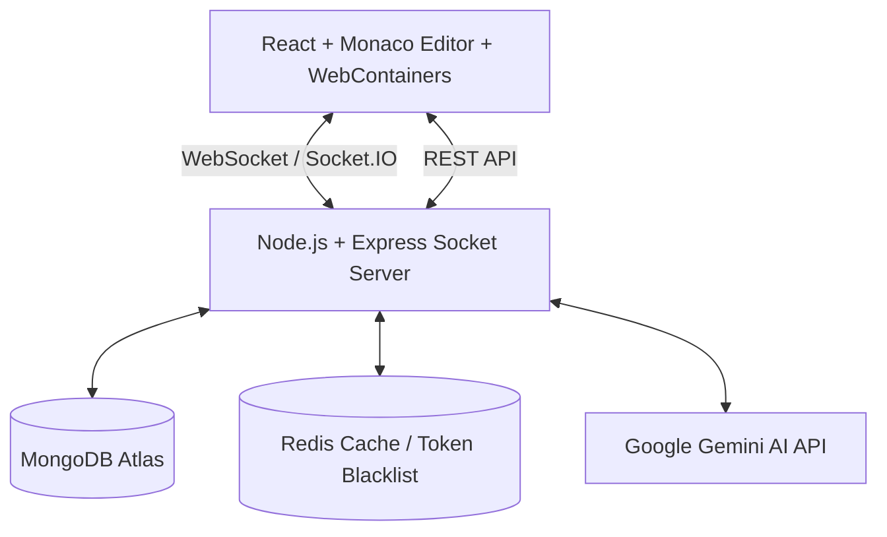

<div align="center">

  <h1>🚀 ChatCraft</h1>
  <p><b>Real-Time Collaborative Cloud IDE & AI-Assisted Development Workspace</b></p>

  <p>
    <a href="https://chat-craft-xi.vercel.app"></a>
    
    
    
    
    
  </p>

</div>

---

## 📌 Overview

**ChatCraft** is a full-stack, real-time collaborative coding platform and cloud IDE built with the **MERN stack**. It empowers teams and developers to build, review, transpile, and execute code directly in the browser with zero server compilation overhead, while leveraging an integrated **Google Gemini AI Assistant (`@ai`)** for on-demand code generation and refactoring.

---

## ✨ Key Features

- ⚡ **Live Real-Time Collaboration**: Multi-user project rooms with synchronized file editing, cursor presence, and instant chat powered by **Socket.IO**.
- 💻 **Monaco Code Editor**: Full-featured VS Code editing experience with syntax highlighting, auto-completion, and multi-tab workspace management.
- 🌐 **Dual In-Browser Execution Engines**:
  - **Chromium / Firefox Engine**: Native StackBlitz WebContainers (`@webcontainer/api`) WASM engine for in-browser Node.js runtime and live server execution.
  - **Safari & Mobile Live Fallback Engine**: CommonJS `require()` polyfill with `@babel/standalone` in-browser transpilation and static asset inlining for 100% parity across iOS and Safari.
- 🤖 **Integrated Gemini AI Assistant**: Context-aware `@ai` assistant directly inside project chat capable of code explanation, bug fixing, and boilerplate generation.
- 💬 **Interactive Chat & Mentions**:
  - Reaction bars (`👍`, `❤️`, `🔥`, `🚀`) with hover micro-interactions.
  - Interactive `@mention` auto-complete and mention navigation counter.
  - In-place message editing, replies, and audio recording clips.
- 📁 **Dynamic File Explorer**: Minimalist file tree with extension-specific Lucide icons, custom folder color-coding, and collapsible panels.
- 🔐 **Secure Authentication**: JWT-based session security with Redis token blacklisting for safe invalidation on logout.

---

## 🏗️ Architecture & Tech Stack


```mermaid
graph TD
    Client[React + Monaco Editor + WebContainers] <--> |WebSocket / Socket.IO| Backend[Node.js + Express Socket Server]
    Client <--> |REST API| Backend
    Backend <--> DB[(MongoDB Atlas)]
    Backend <--> Redis[(Redis Cache / Token Blacklist)]
    Backend <--> Gemini[Google Gemini AI API]
```

### **Frontend**
* **Framework & UI**: React 18, Vite, Tailwind CSS, Framer Motion, Lucide React
* **Editor**: `@monaco-editor/react`
* **In-Browser Execution**: `@webcontainer/api`, `coi-serviceworker`, `@babel/standalone`
* **State Layer**: Redux Toolkit (`@reduxjs/toolkit`), TanStack React Query, React Context

### **Backend**
* **Server**: Node.js, Express.js
* **Real-Time Layer**: Socket.IO (modularized namespace & event handlers)
* **Database & Caching**: MongoDB (Mongoose ODM), Redis (Token Blacklisting)
* **AI Integration**: `@google/generative-ai` (Gemini API)
* **Auth**: JSON Web Tokens (JWT), bcrypt

---

## 📂 Project Structure

```text
ChatCraft/
├── backend/
│   ├── config/             # DB, Redis, Socket, and Axios configurations
│   ├── controllers/        # Route controllers (user, project, ai, etc.)
│   ├── middlewares/        # Auth & validation middlewares
│   ├── models/             # Mongoose schemas (user, project, message)
│   ├── routes/             # Express API route declarations
│   ├── services/           # Services (project, fileTree, ai, message)
│   ├── sockets/            # Modular Socket.io handlers
│   └── server.js           # Server & Socket.io initialization
│
├── frontend/
│   ├── public/             # Static assets & service workers
│   ├── src/
│   │   ├── components/     # CodeEditor, Chat, ArchitectureVisualizer, Stats
│   │   ├── contexts/       # React Context Providers
│   │   ├── store/          # Redux Toolkit Slices (chat, editor, user)
│   │   └── utils/          # WebContainer & tree utilities
│   └── vite.config.js      # Vite configuration
└── README.md
```

---

## 🚀 Quickstart & Local Setup

### 1. Prerequisites
- **Node.js**: v18.0 or higher
- **MongoDB**: Local instance or MongoDB Atlas URI
- **Redis**: Local instance or Upstash/Redis Cloud
- **Google Gemini API Key**: [Get API Key](https://aistudio.google.com/)

### 2. Clone the Repository
```bash
git clone https://github.com/Kunal-Gupta28/ChatCraft.git
cd ChatCraft
```

### 3. Backend Setup
```bash
cd backend
npm install
```
Create a `.env` file in `backend/`:
```env
PORT=3000
NODE_ENV=development
MONGO_URI=your_mongodb_connection_string
REDIS_HOST=localhost
REDIS_PORT=6379
REDIS_PASSWORD=
GEMINI_API_KEY=your_gemini_api_key
JWT_SECRET=your_jwt_secret_key
CLIENT_URL_DEV=http://localhost:5173
```
Run backend:
```bash
npm run dev
```

### 4. Frontend Setup
```bash
cd ../frontend
npm install
```
Create a `.env` file in `frontend/`:
```env
VITE_SERVER_URL=http://localhost:3000
```
Run frontend:
```bash
npm run dev
```
Open **[http://localhost:5173](http://localhost:5173)** in your browser.

---

## 🌐 Live Deployment

* **Live Demo**: [https://chat-craft-xi.vercel.app](https://chat-craft-xi.vercel.app)

---

## 👤 Author

**Kunal Gupta**
* Website: [Portfolio](https://portfolio-website-chi-gilt.vercel.app)
* GitHub: [@Kunal-Gupta28](https://github.com/Kunal-Gupta28)
* Email: [kunal.gmail.91165@gmail.com](mailto:kunal.gmail.91165@gmail.com)
